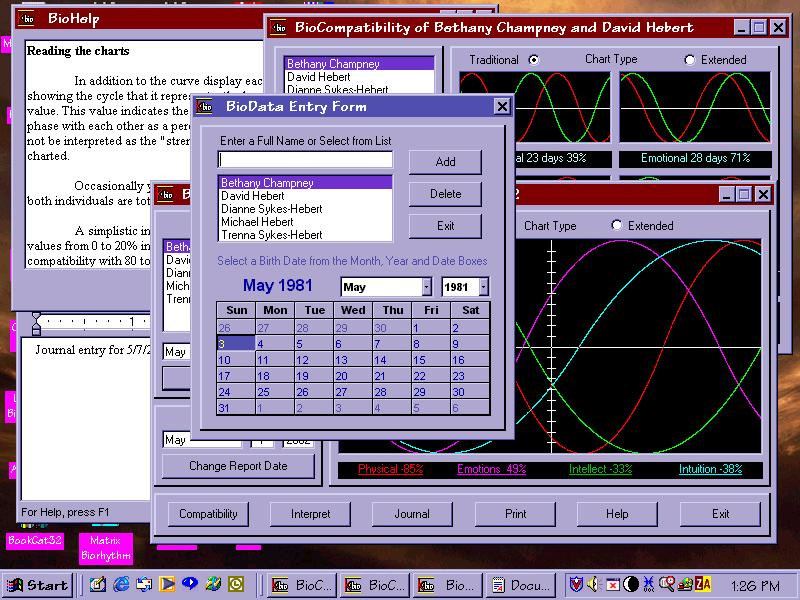



## Kyma BioRhythms \(Re\-upload\)

### Description

Major re-write and expansion of my previous biorhythm program. Now includes database for names, synchronicity (aka compatibility) calculator, helps for operation and interpretation (somewhat sketchy at present) and journaling capability via WordPad. Operationally complete except for report generation. New archive includes forms missing from previous upload. My apologies to all for the omissions. Your comments and/or votes greatly appreciated.
 
### More Info
 

             |
---                |---
**Submitted On**   |2002-05-07 21:47:38
**By**             |[Michael Hebert](https://github.com/Planet-Source-Code/PSCIndex/blob/master/ByAuthor/michael-hebert.md)
**Level**          |Intermediate
**User Rating**    |5.0 (10 globes from 2 users)
**Compatibility**  |VB 5\.0, VB 6\.0
**Category**       |[Complete Applications](https://github.com/Planet-Source-Code/PSCIndex/blob/master/ByCategory/complete-applications__1-27.md)
**World**          |[Visual Basic](https://github.com/Planet-Source-Code/PSCIndex/blob/master/ByWorld/visual-basic.md)
**Archive File**   |[Kyma\_BioRh80653582002\.zip](https://github.com/Planet-Source-Code/michael-hebert-kyma-biorhythms-re-upload__1-34553/archive/master.zip)

